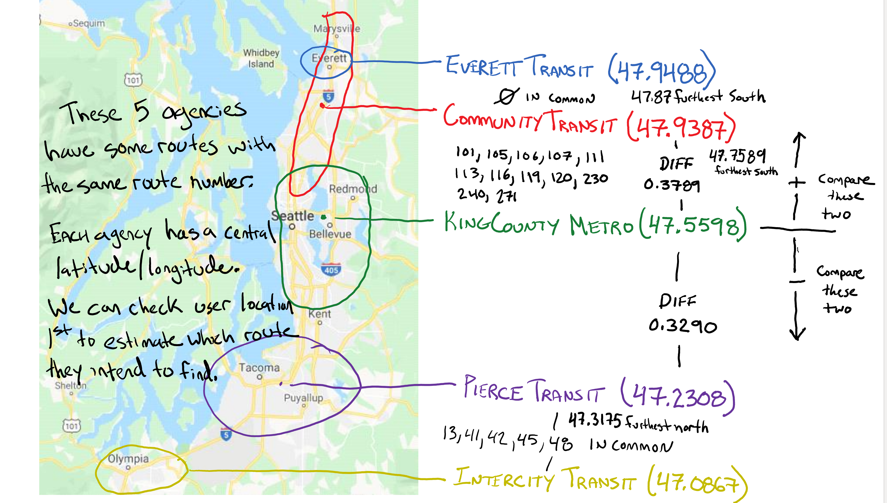

# Where's My Bus (Seattle) - REST API

### Overview
Currently in development for use by the Where's My Bus? mobile application.

Our API requires a user's location and a desired route number and returns the two closest route's locations and time that the desired bus will arrive.

### API < in development >
Example query:
```
http://localhost:8000/api/v1/47.6180384/-122.3310028/255
```

Example response: 
```
{
    "route": "255",
    "closest_stop": {
        "closest_name": "Stewart St & Yale Ave N",
        "closest_direction": "SW",
        "closest_stop_id": "1_905",
        "closest_minutes": 17.0,
        "closest_lat": 47.619019,
        "closest_lon": -122.33017
    },
    "next_closest_stop": {
        "next_closest_name": "Olive Way & Boren Ave",
        "next_closest_direction": "NE",
        "next_closest_stop_id": "1_1051",
        "next_closest_minutes": 1.0,
        "next_closest_lat": 47.615616,
        "next_closest_lon": -122.33017
    }
}
```

### Credit: One Bus Away
Using [One Bus Away](http://developer.onebusaway.org/modules/onebusaway-application-modules/1.1.14/api/where/index.html)'s api to collect data for use by our api. We have collected data and are using it staticlly. We are also using their RESTful API.

One Bus Away uses Google Transit data and GTFS (general transit feed specification) datasets to provide route information. We have collected agency data and route data for all agencies and stored them as JSON. 

agencies.json - http://developer.onebusaway.org/modules/onebusaway-application-modules/1.1.13/api/where/methods/agencies-with-coverage.html

<agency_num><agency_name>.json - http://developer.onebusaway.org/modules/onebusaway-application-modules/1.1.13/api/where/methods/routes-for-agency.html

We make two calls to One Bus Away; the first is to collect all stops for a given route and the second is to get all arival times at a given stop.

### Instructions for local use

When you pull down:
```
Add a .env file inside project dir (wheres_my_bus_backend/)
mkdir static @ root dir
./manage.py collectstatic
```

### Handle Repeated Routes
Where's My Bus? (Seattle) is able to sort out repeated route numbers between the many agencies in the Puget Sound area.




Repeated routes:
<-- Community Transit (North - "lat": 47.938764500000005, "lon": -121.99284) -->
('already in there: ', '101ct')
('already in there: ', '105ct')
('already in there: ', '106ct')
('already in there: ', '107ct')
('already in there: ', '230ct')
('already in there: ', '111ct')
('already in there: ', '113ct')
('already in there: ', '116ct')
('already in there: ', '119ct')
('already in there: ', '240ct')
('already in there: ', '120ct')
('already in there: ', '271ct')

<-- Everett Transit (North - "lat": 47.9488655, "lon": -122.2443695) -->
('already in there: ', '70et')
('already in there: ', '2et')
('already in there: ', '3et')
('already in there: ', '4et')
('already in there: ', '7et')
('already in there: ', '8et')
('already in there: ', '12et')
('already in there: ', '18et')
('already in there: ', '29et')

<-- Pierce Transit (South - "lat": 47.2308535, "lon": -122.418351) -->
('already in there: ', '1pt')
('already in there: ', '2pt')
('already in there: ', '3pt')
('already in there: ', '4pt')
('already in there: ', '402pt')
('already in there: ', '425pt')
('already in there: ', '202pt')
('already in there: ', '212pt')
('already in there: ', '214pt')
('already in there: ', '102pt')
('already in there: ', '10pt')
('already in there: ', '11pt')
('already in there: ', '13pt')
('already in there: ', '28pt')
('already in there: ', '41pt')
('already in there: ', '45pt')
('already in there: ', '48pt')
('already in there: ', '55pt')
('already in there: ', '57pt')
('already in there: ', '63pt')

<-- Intercity Transit (South - "lat": 47.086729000000005, "lon": -122.7009125) -->
('already in there: ', '47it')
('already in there: ', '48it')
('already in there: ', '60it')
('already in there: ', '64it')
('already in there: ', '67it')
('already in there: ', '42it')
('already in there: ', '12it')
('already in there: ', '13it')
('already in there: ', '21it')
('already in there: ', '41it')
('already in there: ', '45it')